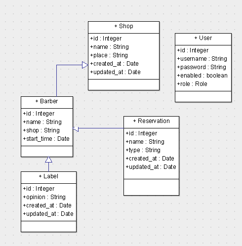
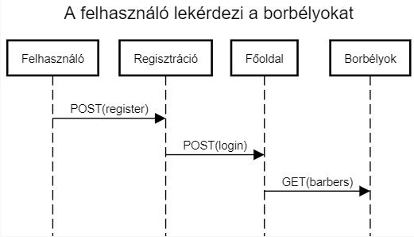

# 1. Projektötlet

Ebben az alkalmazásban barátikörök vihetnek fel különböző összejöveteleikről számlákat. Az egyes emberek megadhatják, hogy ki mennyivel tartozik egy adott számlába. A felvitt számlához kötelezően csatolni kell egy képet a blokkról, ezután pedig az adminisztrátornak jóvá kell hagynia. Ezen kívül minden tag le tudja kérdezni a számlánkénti és az összes tartozását. A tartozások kiegyenlítéséhez is adminisztrátori jóváhagyás szükséges.

## 1.1 Funkcionális követelmények:

	* Felhasználó az e-mailéhez létrehoz egy jelszót 
	* Bejelentkezés után a kívánt fodrászüzletet, a szimpatikus fodrászt és a kívánt időpontot ki tudja választani 
	* Az időpontját vissza tudja nézni vagy törölni

## 1.2 Nem funkcionális követelmények:

	* Az időpontok ütközésének a megoldása 
	* Üzlet választás után ne tudjon olyan fodrászt választani aki nem abban az üzletben dolgozik 
	* Minden 10. hajvágás ingyenes

## 1.4 Szerepkörök:

	* Admin
	* Felhasználó : vásárlók

## 1.5 Folyamatok: 
* Bejelentkezés -> Fodrászat kiválasztás -> Időpont választása -> Fodrász kiválasztás -> Foglalás

# 2. Backend megvalósítása

## 2.1 Fejlesztői környezet:

* Github: (/idkbalazs/AlkFejl)
* IDE: IntelliJ IDEA
* Database: H2

## 2.2 Adatbázis terv:

## 2.3 Könyvtárstruktúra:

* controllers
  * BarberController.java
  * LabelController.java
  * ReservationController.java
  * ShopController.java
  * UserController.java
* entities
  * Barber.java
  * Label.java
  * Reservation.java
  * Shop.java
  * User.java
* repositories
  * BarberRepository.java
  * LabelRepository.java
  * ReservationRepository.java
  * ShopRepository.java
  * UserRepository.java
* security
  * AuthenticatedUser.java
  * CustomBasicAuthenticationEntryPoint.java
  * MyUserDetailsService.java
  * WebSecurityConfig.java
* BarbershopApplication.java

## 2.4 Végpontok:

### GET
    /barbers                  Összes barber listázása
    /barbars/id               Egy barber oldalának megtekintése
    /barbers/id/reservations  Barberhez tartozó foglalások
    /barbers/id/labels        Barberhez tartozó vélemények
    /reservations             Összes foglalás listázása
    /reservations/id          Egy foglalás oldalának megtekintése
    /labels                   Összes vélemény listázása
    /labels/id                Egy vélemény oldalának megtekintése
    /shops                    Összes barbershop listázása
    /shops/id                 Egy barbershop listázása
    /shops                    Összes barbershop listázása
    
### POST
    /register                 Új felhasználó regisztrálása
    /login                    Felhasználó bejelentkezése
    /barbers                  Új barbert adunk az adatbázishoz
    /barbers/id/reservations  Új foglalást tudunk hozzáadni egy barberhez
    /barbers/id/labels        Új véleményt tudunk hozzáadni egy barberhez
    /reservations             Új foglalást adunk az adatbázishoz
    /labels                   Új véleményt adunk az adatbázishoz
    /shops                    Új barbershopot adunk az adatbázishoz
    
### PUT
    /barbers/id           Barberhez tartozó adatok módosítása
    /barbers/id/labels    Barberhez tartozó vélemények móosítása
    /labels/id            Véleményhez tartozó adatok módosítása
    /reservations/id      Foglaláshoz tartozó adatok módosítása
    /shops/id             Barbershophoz tartozó adatok módosítása
    
### DELETE
    /barbers/id           Barber törlése az adatbázisból
    /labels/id            Vélemény törlése az adatbázisból
    /reservations/id      Foglalás törlése az adatbázisból 
    /shops/id             Barbershop törlése az adatbázisból

## 2.5 Egy végpont bemutatása:

# 3. Működő prototípus

## 3.1 Használati eset diagram: Melyik szerepkör mely felületekhez fér hozzá

## 3.2 Fejlesztői környezet bemutatása, Beállítása, Használt technológiák

* IDE: Visual Studio Code

* Node.js környezet telepítése

* NPM telepítése  
` /npm install ` 

* Példa program klónozása lokális gépre: 
` /git clone https://github.com/elteKrisztianKereszti/alkfejl_client_2019_1 `

* App indítása tesztelés végett 
` /ng server `

* Ha kész akkor felpusholjuk GitHub-ra.

## 3.3 Az alkalmazott könyvtárstruktúra bemutatása

* `app` Alkalmazás logika
   * `login-form` A bejelentkezéshez szükséges fájlok
   * `models` Modell osztályok felépítés és logikája
   * `routing` URL és komponens kapcsolatok
   * `services` Adatbázis adatok lekérésehez szükséges komponensek
   * `reservation-detail` Az adatok módosításához szükséges fájlok
   * `reservation-Form` A formhoz szükséges fájlok
   * `reservation-list` A foglalások kilistázásáért felel

# 4. Kész alkalmazás

## 4.1	 kliensoldali szolgáltatások listája, rövid leírással

**Regisztráció:** 
Regisztálni kell, hogy tudjuk használni az alkalmazást.

**Foglalás hozzáadása:** 
Ha foglalást készítünk akkor bejön egy form és meg kell adni a nevet a beavatkozás típusát és a barbert.

**Foglalás módosítása:**
A felhasználó módosíthatja a foglalását egy új formon.

**Foglalás törlése:** 
Foglalás után a felhasználó törölheti a foglalást.

## 4.2 Funkciók

`reservation-service.service.ts`
* `get_()`	- a paraméterként megadott id alapján lekérdezhető a foglalás(Név,Beavatkozás típusa, barber, vélemények)
* `create_()` – létrehozható egy új foglalás
* `update_()` – módosítja a foglalást
* `delete_()` – kitörli a foglalást
 Ezen kívül a `reservation-service.service.ts`-ben létezik még:
* `getReservations()` – ez kilistázza az összes foglalást.

## 4.3	Egy funkció folyamatának leírása, azaz mi történik kattintástól a visszajelzésig

## 4.4 Felhasználói dokumentáció

**Telepítés előtti szükséges lépések:**
* Legyen feltelepítve a NodeJs
* Legyen internetkapcsolat

**Telepítés:**
* Keresse fel a https://github.com/idkbalazs/Alkfejl oldalt és töltse le a **Clone or Download** majd a **Download ZIP** gombok megnyomásával a Repository tartalmát
* Nyissa meg a Net Beans programot, ezzel nyissa meg `barbershop` projektet
* Mindenképpen **Clean&Build**-elje a projektet az indítás előtt.
* A Visual Studio Code használatával nyissa meg a `barbershop_client`-et
* A terminálban az `ng serve` parancs kiadásával el tudja indítani a klienst
	
**Használat:**
* A böngészősávba beírjuk az oldal elérését : `localhost:4200`
* Regisztrálás és bejelentkezés után pedig már használható a program
